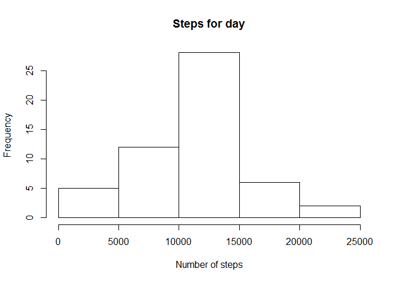
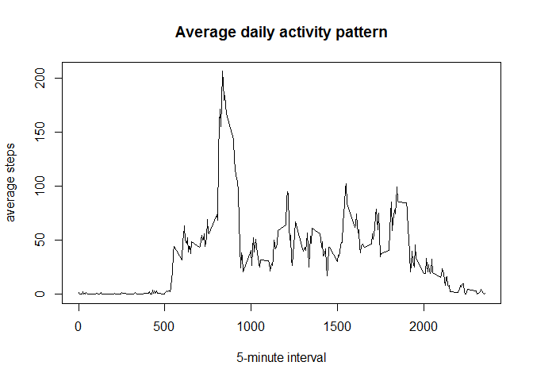

# PA1_template.rmd
Andrea Bruna  
09 December 2016  


## Coursera Reproducible Research. Peer Assessment Week 2

This project makes use of data from a personal activity monitoring device which collected the number of steps taken in a 5 minutes interval each day for two months from an anonymous individual.
This data was acquired by forking the following github repository:
[github.com/rdpeng/RepData_PeerAssessment1](github.com/rdpeng/RepData_PeerAssessment1).

The dataset is stored as a comma-separated-value file with an header row and 17568 observations.

### Reading the dataset and processing the data
The following code chunks download and load the data from a zip file


```r
temp <- tempfile()
download.file("https://d396qusza40orc.cloudfront.net/repdata%2Fdata%2Factivity.zip",temp)
data <- read.table(unz(temp, "activity.csv"), sep=",", header=TRUE, stringsAsFactors = FALSE)
unlink(temp)
```

The number of observation should be: 17568 for three variables. If there is a value mismatch double check the file has not been modified or moved from the original location as the following assumptions are (most probably) not valid anymore.

```r
dim(data) == c(17568, 3)
```

```
## [1] TRUE TRUE
```


### Histogram of the total number of steps taken each day and mean/median of the population

The following histogram describes the relative frequency of the total number of steps during the days of the period analyzed.


```r
temp <- aggregate(data$steps, by=list(data$date), FUN=sum)
hist(temp$x, xlab="Number of steps", main="Steps for day")
```

<!-- -->

The mean and median of the values of the dataset are respectively:


```r
mean(temp$x, na.rm=TRUE)
```

```
## [1] 10766.19
```

```r
median(temp$x, na.rm=TRUE)
```

```
## [1] 10765
```

According to the data and the graph most of the steps measures fall in the range *10000-15000*

### Daily activity pattern

The following histogram shows the average daily activity pattern. 
The graph also includes the observations for which the steps taken measures are missing


```r
temp2 <- aggregate(data$steps, by=list(data$interval), FUN=mean, na.rm=TRUE)
plot(temp2$Group.1, temp2$x, type="l", xlab="5-minute interval", ylab= "average steps", main="Average daily activity pattern")
```

<!-- -->

Taking into consideration the previous observations it's reasonable thinking that there might be time of the day the subjects walk more
This suggests that between *08:00am and 10:00am* the subject is generally more active.

### Maximum number of steps for time interval

The previous plot narrow the range however, if more granularity is needed, finding the exact 5-minute interval that (on average) includes the maximum number of steps in out tests cases, is quite trivial.


```r
temp2[which.max(temp2$x),1]
```

```
## [1] 835
```

In terms of time of the day such a value is equal to:

```r
paste(substr(temp2[which.max(temp2$x),1],1,1), ":", 
  substr(temp2[which.max(temp2$x),1],2,3), sep="")
```

```
## [1] "8:35"
```

## Part 2: Overcoming the issue of missing values

In the original data set there are missing values for a certain numbers of days. The exact number of "NA" is:


```r
sum(is.na(data$steps))
```

```
## [1] 2304
```


In order to provide an answer to the most obvious question/objection: "are the missing values producing misleading results?", different approaches might be devised.

The simplest strategies to fill the missing values are essentially two:
1. replace the "NA"" values with the mean or median for the same day
2. use the mean of the same 5-minute interval for the observation period

The first option is reasonable unfortunately it would not work so well. In fact, there are days the values are not available at all.
For example the data for "2012-10-01" are completely missing:

```r
data[which(data$date == "2012-10-01"),1]
```

```
##   [1] NA NA NA NA NA NA NA NA NA NA NA NA NA NA NA NA NA NA NA NA NA NA NA
##  [24] NA NA NA NA NA NA NA NA NA NA NA NA NA NA NA NA NA NA NA NA NA NA NA
##  [47] NA NA NA NA NA NA NA NA NA NA NA NA NA NA NA NA NA NA NA NA NA NA NA
##  [70] NA NA NA NA NA NA NA NA NA NA NA NA NA NA NA NA NA NA NA NA NA NA NA
##  [93] NA NA NA NA NA NA NA NA NA NA NA NA NA NA NA NA NA NA NA NA NA NA NA
## [116] NA NA NA NA NA NA NA NA NA NA NA NA NA NA NA NA NA NA NA NA NA NA NA
## [139] NA NA NA NA NA NA NA NA NA NA NA NA NA NA NA NA NA NA NA NA NA NA NA
## [162] NA NA NA NA NA NA NA NA NA NA NA NA NA NA NA NA NA NA NA NA NA NA NA
## [185] NA NA NA NA NA NA NA NA NA NA NA NA NA NA NA NA NA NA NA NA NA NA NA
## [208] NA NA NA NA NA NA NA NA NA NA NA NA NA NA NA NA NA NA NA NA NA NA NA
## [231] NA NA NA NA NA NA NA NA NA NA NA NA NA NA NA NA NA NA NA NA NA NA NA
## [254] NA NA NA NA NA NA NA NA NA NA NA NA NA NA NA NA NA NA NA NA NA NA NA
## [277] NA NA NA NA NA NA NA NA NA NA NA NA
```

I _personally_ consider the second option better. Considering that men and women are tipically creatures of habit, it would probably make more sense.

Consequently, the original data are merged with the equivalent average daily activity pattern for the same "5 minute" interval. The steps value for all the observation are preserved while, if equal to "NA", it is replaced with the mean of the 5-minute interval to create a new dataset equal to the original but with the missing data filled in. (I chose not to delete potentially redundant columns because they might prove to be useful in subsequent tasks)


```r
data2 <- merge(data, temp2, by.x="interval", by.y="Group.1", sort=FALSE, all.x=TRUE)
data2$steps[is.na(data2$steps)] <- data2$x[data2$x]
```

### Revised Histogram of the total number of steps taken each day and mean/median of the population

The revised histogram after aggregating the data and creating a "new"" dataset is the following:


```r
temp3 <- aggregate(data2$steps, by=list(data2$date), FUN=sum)
hist(temp3$x, xlab="Number of steps", main="Steps for day")
```

<!-- -->

while the new mean and median are:

```r
mean(temp3$x)
```

```
## [1] 9417.703
```

```r
median(temp3$x)
```

```
## [1] 10395
```

Let us compare the mean and median values for both the datasets:

```r
abs(mean(temp$x, na.rm=TRUE)-mean(temp3$x))
```

```
## [1] 1348.485
```

```r
abs(median(temp$x, na.rm=TRUE)-median(temp3$x))
```

```
## [1] 370
```

Compared to the previous set, the differences are minimal and the error acceptable, therefore we can assume that _the missing values did not excessively impact the original calculations and assumptions_: 

## Analyze potential patterns difference between weekdays and weekend days

The following steps try to establish if there are significantly different activity patterns between the steps taken during the working week days and the weekends.
This step requires classifying the data in two frame according to the week day of the measures then plotting a graph comparing the results.

(Please note that, with my specific combination of Operating System, hardware architecture and locale settings, I had to reset the global "locale" variable to get the name of the weekdays in english). 


```r
Sys.setlocale("LC_TIME", "C")
```

```
## [1] "C"
```

```r
weekend <- data[grepl("S(at|un)", weekdays(as.Date(data$date))),]
weekday <- data[grepl("Mon|Tue|Wed|Thu|Fri", weekdays(as.Date(data$date))),]
avg_weekend <- aggregate(weekend$steps, by=list(weekend$interval), FUN=mean, na.rm=TRUE)
avg_weekday <- aggregate(weekday$steps, by=list(weekday$interval), FUN=mean, na.rm=TRUE)


par(mfrow=c(2,1), mar = c(0, 0, 1, 2), oma = c(4, 4, 2, 2))
plot(avg_weekend$Group.1, avg_weekend$x, type="l",  xaxt = "n", main="weekend", cex.main=1)
plot(avg_weekday$Group.1, avg_weekday$x, type="l", xlab="interval", main="weekday", cex.main=1)
mtext("Number of steps", side = 2, outer = TRUE, line = 2)
mtext("Interval", side = 1, outer = TRUE, line = 2)
```

<!-- -->

The graph seems to indicate that the subject is on average more active in the weekends however,in the weekdays, there are higher "peaks"" of activity especially during the morning. 
